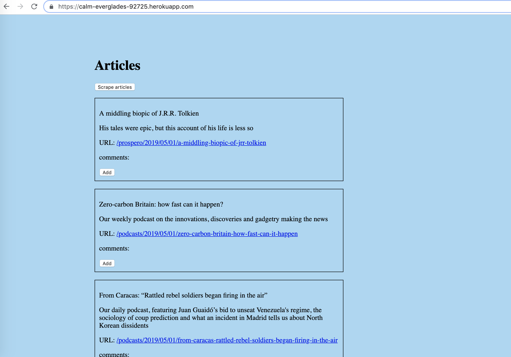
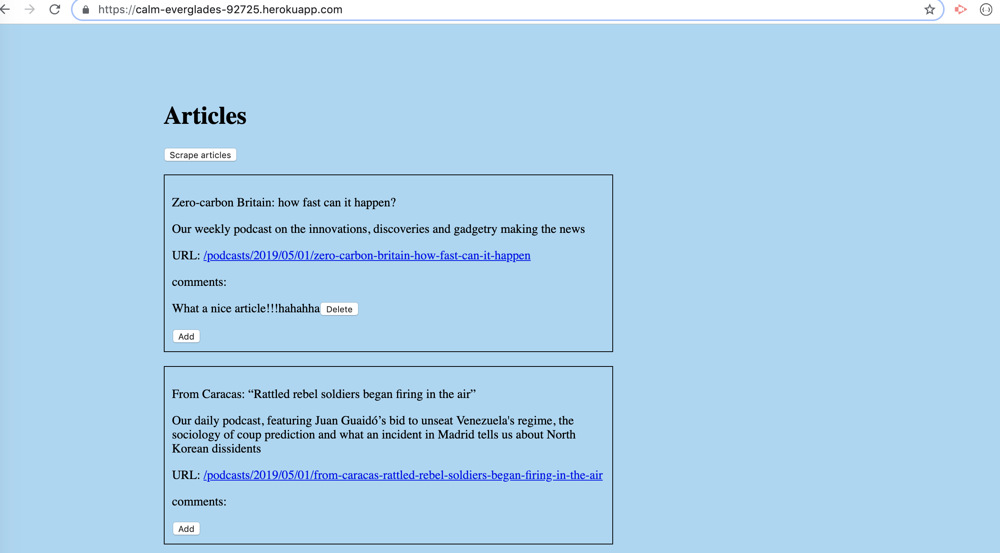
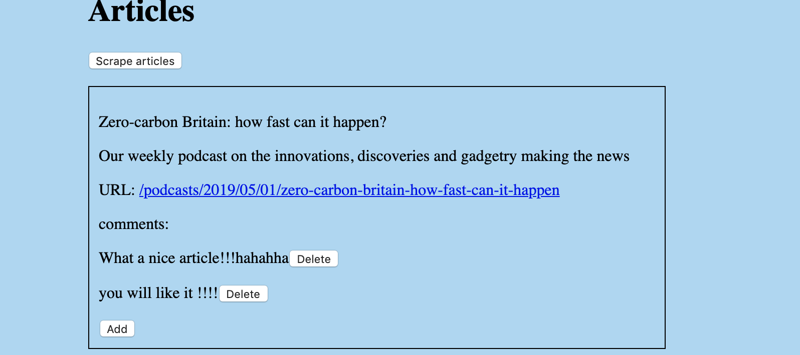

# All-the-News-That-s-Fit-to-Scrape

* Welcome to All-the-News-That-s-Fit-to-Scrape! Here we have a web app that lets users leave comments on the latest news. But you're not going to actually write any articles; instead, we flex your Mongoose and Cheerio muscles to scrape news from another site.

##  Technologies

| Frontend  | Backend |
| ------------- | ------------- |
| HTML | Nodejs |
| CSS (SASS) | Express |
| Javascript (jQuery) | MongoDB (Mongoose)|
|  | Cheerio (Web Scrapper) |

## Requirements
* Web Browser
* Nodejs
* Mongo DB


## Project setup
```
git clone https://github.com/NadireGh/All-the-News-That-s-Fit-to-Scrape.git
```
```
npm install
```
```
node server.js
```
```
open browser on localhost:3000
```

## Screenshots





